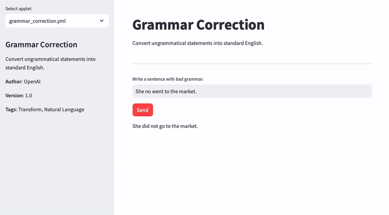
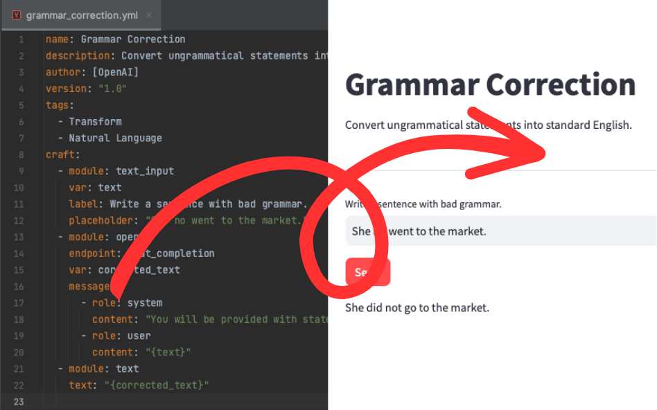

# CraftAI: Your Personal, Self-Hosted AI Toolkit



CraftAI is a self-hostable AI application that empowers users and developers to create highly customizable personal AI
tools. With the power of GPT technology, users can generate AI tools for various purposes using pre-defined prompts.

## 💡 Features

- **🧩 Customizable Applets**: CraftAI allows you to craft AI tools tailored to your specific needs.

- **🤖 GPT-Powered**: Leverage the cutting-edge GPT technology to create intelligent AI applications.

- **🔧 Simple Configuration**: Define your AI tools using straightforward YAML files.

- **✨ Endless Possibilities**: Your imagination is the limit when it comes to the applications you can create.

## 🚀 Getting Started

To get started with CraftAI, simply clone this repository and run it.

### 🐳 Build with Docker

```bash
git clone https://github.com/batuhan0sanli/CraftAI
cd CraftAI
docker build -t craftai .
docker run -p 8501:8501 -e OPENAI_API_KEY=<YOUR_API_KEY> craftai
```

### 🐍 Run with Python

If you provide a `.env` file within the main directory, it will be loaded.

```bash
pipenv install
pipenv run up
```

## 📖 Usage

CraftAI comes with pre-built AI tools called applets. You can select and start using these tools from the menu. To use
your own custom applets, simply copy the YAML file you've created to the `applets` folder.
Afterward, you will be able to see your applet in the menu.

### 📱 Applets

- **Grammar Correction**: Convert ungrammatical statements into standard English.
- **Playground OpenAI**: Playground OpenAI with System and User messages.
- **Summarize**: Summarize a text with a given length.

## 📚 Develop an Applet

CraftAI allows you to create AI tools tailored to your specific needs. To create an AI tool, you need to define a YAML
file that contains the following fields:

- **name**: The name of your AI tool.
- **description**: A short description of your AI tool.
- **author**: A list of authors of your AI tool.
- **version**: The version of your AI tool.
- **tags**: A list of tags that describe your AI tool.
- **craft**: The modules in which you define the applet.



### 📦 Modules

CraftAI allows you to define your applet in multiple modules. Each module is defined by a YAML file. The following
modules are currently supported:

- openai
- text
- text_input
- text_area_input
- selectbox
- columns

## 🤝 Contributing

We welcome contributions from the community.
<!-- Please read our [Contributing Guide](CONTRIBUTING.md) for more information on how to get involved. -->

## 📄 License

CraftAI is released under the [GNU License](LICENSE.md).
